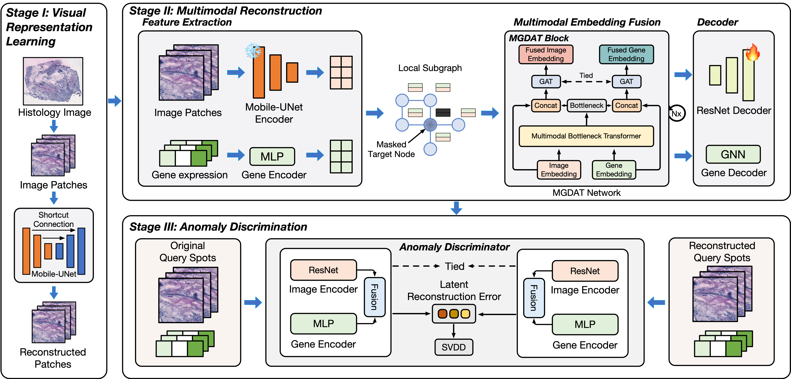

# [AAAI 2025] MEATRD: Multimodal Anomalous Tissue Region Detection Enhanced with Spatial Transcriptomics
```
@Article{MEATRD_2025,
    author={Xu, Kaichen and Wu, Qilong and Lu, Yan and Zheng, Yinan and Li, Wenlin and Tang, Xingjie and Wang, Jun and Sun, Xiaobo},
    journal={Proceedings of the AAAI Conference on Artificial Intelligence},
    title={MEATRD: Multimodal Anomalous Tissue Region Detection Enhanced with Spatial Transcriptomics},
    year={2025},
    volume={39},
    number={12},
}
```
## About
The detection of anomalous tissue regions (ATRs) within affected tissues is crucial in clinical diagnosis and pathological studies. Conventional automated ATR detection methods, primarily based on histology images alone, falter in cases where ATRs and normal tissues have subtle visual differences. The recent spatial transcriptomics (ST) technology profiles gene expressions across tissue regions, offering a molecular perspective for detecting ATRs. However, there is a dearth of ATR detection methods that effectively harness complementary information from both histology images and ST. To address this gap, we propose MEATRD, a novel ATR detection method that integrates histology image and ST data. MEATRD is trained to reconstruct image patches and gene expression profiles of normal tissue spots (inliers) from their multimodal embeddings, followed by learning a one-class classification AD model based on latent multimodal reconstruction errors. This strategy harmonizes the strengths of reconstruction-based and one-class classification approaches. At the heart of MEATRD is an innovative masked graph dual-attention transformer (MGDAT) network, which not only facilitates cross-modality and cross-node information sharing but also addresses the model over-generalization issue commonly seen in reconstruction-based AD methods. Additionally, we demonstrate that modality-specific, task-relevant information is collated and condensed in multimodal bottleneck encoding generated in MGDAT, marking the first theoretical analysis of the informational properties of multimodal bottleneck encoding. Extensive evaluations across eight real ST datasets reveal MEATRD's superior performance in ATR detection, surpassing various state-of-the-art AD methods. Remarkably, MEATRD also proves adept at discerning ATRs that only show slight visual deviations from normal tissues.

<div align=center>

</div>

## Setup

```
git clone https://github.com/wqlzuel/MEATRD
cd MEATRD
pip install -r requirements.txt
```

## Usage
Please download the processed dataset and store it in the ```/data/``` directory, then run:
```
python main.py --data_path ./data/
```

## Dataset
- The raw AnnData files of 10x-hNB can be downloaded from [here](https://cellxgene.cziscience.com/collections/4195ab4c-20bd-4cd3-8b3d-65601277e731)
- The raw AnnData files of 10x-hBC-{A1-H1} can be downloaded from [here](https://github.com/almaan/her2st)
- The raw AnnData files of 10x-hBC-I1 can be downloaded from [here](https://zenodo.org/records/10437391)
- The preprocessed dataset can be downloaded from [here](https://drive.google.com/drive/folders/1PE_n5X8cY3t4RNYVDtwJW-k5i8p6XqoU?usp=drive_link)

## Code organization
- `configs/` - Configuration files for each task and dataset
- `data/` - The dataset is pre-processed by DGL
- `utils.py` - Util functions (including evaluation suite)
- `main.py` - Main python script for running anomaly detection task
- `pretrain.py` - Python script for pretraining MobileUNet
- `build_datasets.py` - Python scripts for preprocessing
- `MobileUNet.pth` - The pre-trained weights for MobileUNet

In the folder `model`:
- `model/fusion.py` - Multi-modal fusion modules
- `model/meatrd.py` - MEATRD framework for step II and step III
- `model/loss.py` - Loss function of MEATRD
- `model/unet.py` - MobileUNet of MEATRD


## Contact
If you have any questions, please contact Kaichenxu358@gmail.com.
